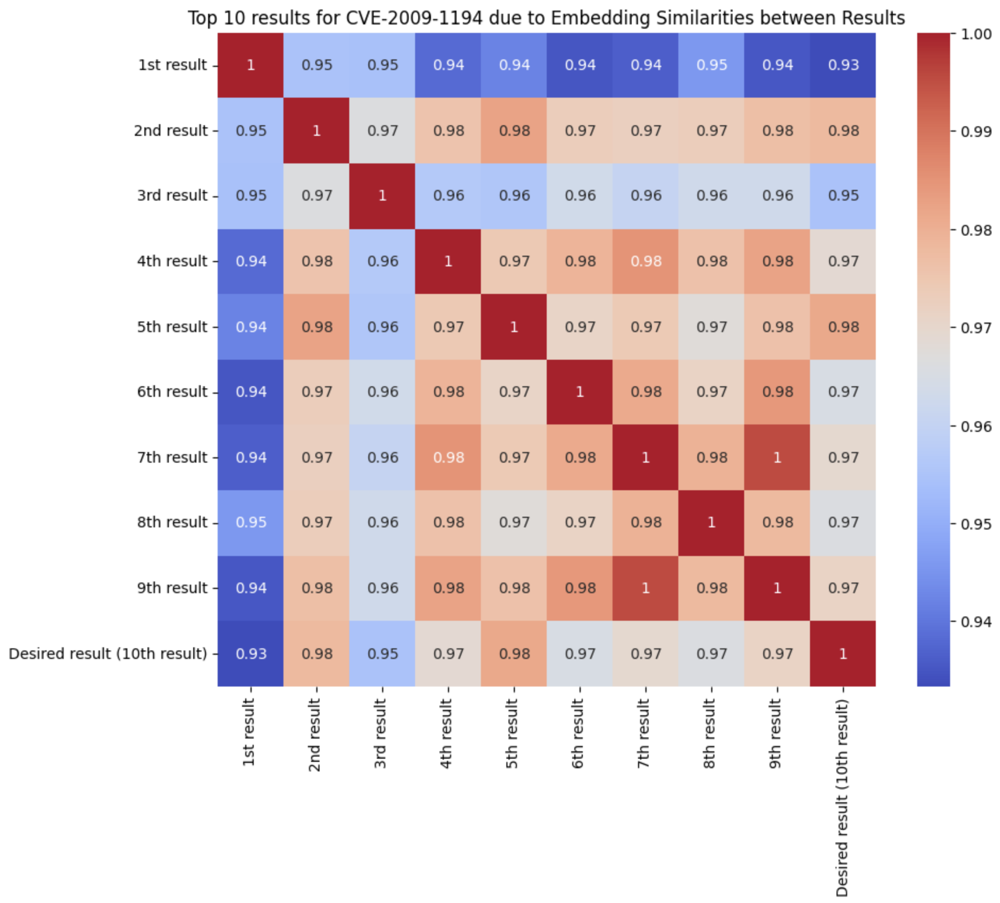

# Vanilla Pattern

## Intent

The Vanilla Pattern simplifies the embedding and retrieval process by storing all relevant information about a vulnerability in a single context string. With this pattern, all the important details about a vulnerability (e.g., the CVE ID, CWE ID, CWE description) are embedded together in a single string.

## Motivation

The Vanilla Pattern is very useful when dealing with datasets where all relevant information can be captured within a single context block like a paragraph from a book or an article. The motivation behind this pattern is simplicity, allowing us to store and straightforwardly retrieve relevant data. This approach is particularly useful in scenarios where the distinctions between different fields of information are minimal. Combining all of this into a single string for embedding makes the process easier in datasets like CVEFixes and BigVul, where a CWE and related contextual data accompany each vulnerability.

While this method ensures that all the data is considered during embedding, the overlap of similar tokens can lead to issues. For example, trying to retrieve data for CVE-2009-1194 belonging to CWE-189 returned results where CVE-2009-1194 was not found in the top-10 results. The retrieval system retrieves multiple CVEs that are not necessarily related to the specific CVE (CVE-2009-1194) in the query.  
Instead, it retrieves other CVEs, such as CVE-2015-8872 and CVE-2013-7010, due to the similarity in their embeddings caused by the shared CWE details, including CWE names, IDs, descriptions, and extended descriptions. These shared details lead to similar embeddings that result in retrieval inaccuracies.

### Token Similarity Plot

Here we show the plot of the embedding similarities for the results retrieved by querying the vector database for CVE-2009-1194 in the CVEFixes dataset.

## Applicability

The Vanilla Pattern is applicable in cases where the dataset consists of compact textual information that can be effectively represented in a single block. It is particularly useful when the primary goal is to simplify the embedding and retrieval process without the need for filtering or segmentation. Additionally, it works best when the data has minimal variability, as this reduces the risk of embeddings overlapping and causing retrieval inaccuracies.

The Vanilla Pattern works very well for datasets like Mitre CWE, where the data entries are more distinct and well-structured.

## Advantages

The Vanilla Pattern is simple to implement, requiring minimal processing and making it a straightforward approach for embedding generation and retrieval. Additionally, it provides a unified context by ensuring that all relevant data is considered when generating the embedding, reducing the risk of overlooking important information during retrieval.

## Disadvantages

The Vanilla Pattern does come with some limitations. One major drawback is that it can create dense embeddings by combining all fields into a single context. This can result in CVEs that share similar tokens, such as those belonging to the same CWE category, producing similar embeddings, which may lead to retrieval inaccuracies. Additionally, this pattern has limited applicability for larger datasets, especially those containing repetitive information between CVEs, as it does not effectively capture field-specific differences, potentially impacting retrieval performance.

## Implementation

In our implementation, we concatenate multiple metadata fields (e.g., CWE-ID, CWE name, descriptions) into a single string. We embed the context string into dense vectors using a pre-trained dense model and sparse vectors using a sparse model. We focus primarily on the combined context string for encoding. When querying the vector database, the encoder transforms the query string into dense and sparse vectors using the same models as for the context strings. The encoded query vectors are used to search the vector database, leveraging dense and sparse vectors for retrieval.

### Vanilla Pattern Workflow

